<div align="center">

# Metal Gear Mechanics

A third-person stealth game in Unity, built around mechanics from Metal Gear Solid


[Features](#features) · [Controls](#controls) · [Getting Started](#getting-started) · [Project Structure](#project-structure)

</div>

<p align="center">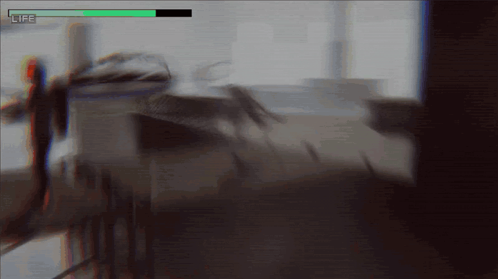</p>

## Overview

This is my attempt at recreating the core systems from Metal Gear Solid in Unity. Guards patrol and spot you with a field-of-view check, you can grab them from behind with CQC, hug walls while the camera swings around, hide under a cardboard box, and shoot your way out when all of that fails. Guns have bullet spread and magazines, and there's an inventory for the weapons and items you pick up.

## About this project

I built the first version in fall 2023 for a game programming class at UIW, following tutorials to get each system working. The early commit history is from that semester, and you can tell from the messages which nights went badly.

In 2026 I came back to it as an exercise: read the whole project with what I know now, find what was wrong, and fix it. That pass covered:

- Splitting the guard AI out of one 700-line class driven by bool flags into separate state classes (more on that below)
- Fixing inventory bugs, like being able to equip items you never picked up
- Cutting per-frame allocations by caching animator hashes and switching physics queries to their non-allocating versions
- Fixing object pooling after a scene reload
- Moving loose scripts into the right folders and cleaning up naming

The guard AI was the hardest part, both times. Guards have to see you, warn each other, chase, lose you, and search, and in the original version all of that ran through the same `Update` method. One detail that came out of the rewrite: when a guard raises the alarm, the alert also reaches the guard that sent it. The old code only avoided an infinite loop by accident, because of the order its flags were set in. Now the guard enters its alert state before warning anyone, and a comment explains why.

All the code under `Assets/_MyAssets/Scripts` is mine. The character models, animations, environment kits, PSX shader and particle effects are third-party assets.

## Features

### Stealth and detection

Guards walk set waypoint routes and check for you inside a view cone. If one spots you, the guards nearby get your last known position and head there, so the goal is to stay out of sight and use cover.

<p align="center">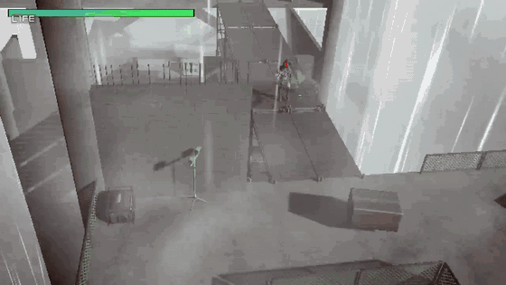</p>

### Combat

Shots have spread, you have to manage your magazine, and the muzzle flash is a particle effect. Guards shoot back, and if you break line of sight they go looking for you.

<p align="center">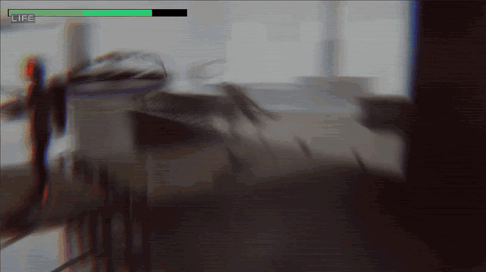</p>

### CQC grab

Sneak up behind a guard and grab them. They'll struggle, and either you overpower them or they break free and alert the others.

<p align="center">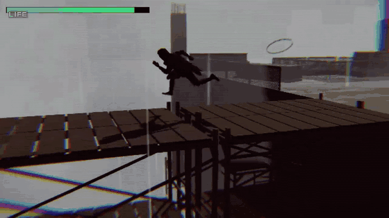</p>

### Cardboard box

Guards ignore the box as long as it stays still. Move while they're looking and you're caught.

<p align="center">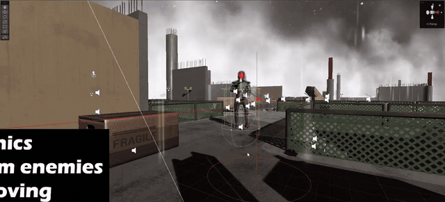</p>

### Wall cover

Press against a wall to lean and peek around corners. The camera changes angle depending on where you are along the wall.

<p align="center">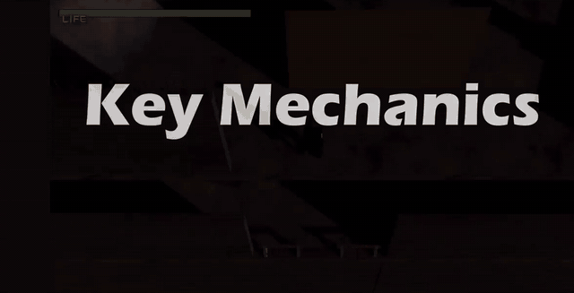</p>

### Inventory and weapons

You pick up weapons and items around the level and swap between them from a scrollable inventory.

<p align="center">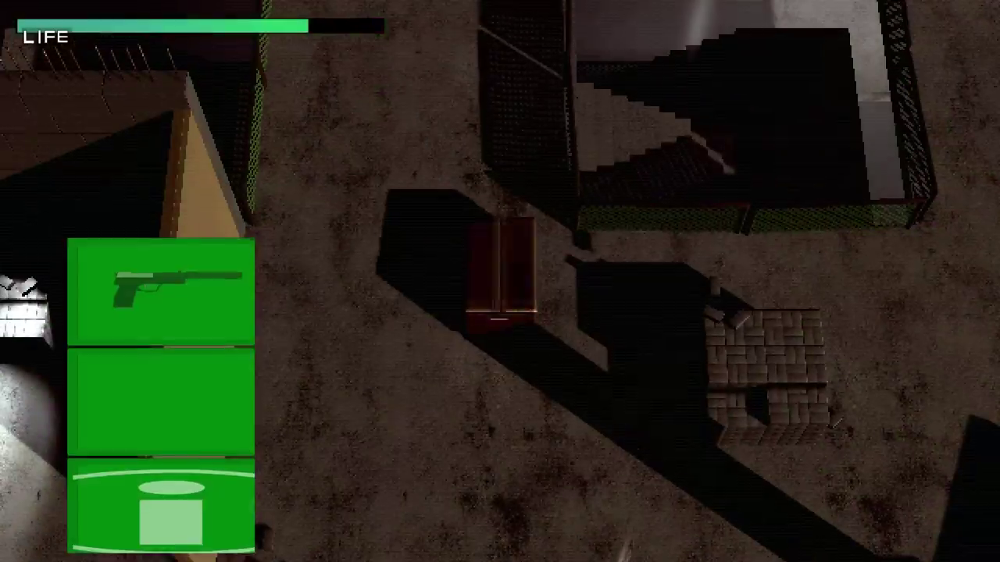</p>

## AI behavior

Each guard runs a state machine. Every state is its own class in `Scripts/AI/States`, and `AIController` holds the shared pieces (detection, movement, shooting) and switches between them.

| State | What the guard does |
|-------|----------|
| Patrol | Walks a waypoint route, with a wait time and look direction you can set per point |
| Caution | The "?!" moment: stops and turns toward whatever it noticed, then chases or searches |
| Combat | Chases while it can see you and fires in bursts once in range, reloading when the magazine runs out |
| Search | Runs to where it last saw you, then scans and checks random nearby spots |
| Grabbed | Held in CQC; the player's grab code drives it until it's killed or breaks free |

The inspector shows each guard's current state while the game runs, which makes it easier to debug.

<p align="center">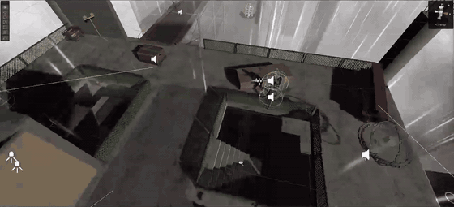</p>

### Alert countdown

Getting spotted starts an alarm countdown on the HUD. If you stay hidden until it runs out, the guards go back to their patrols.

<p align="center">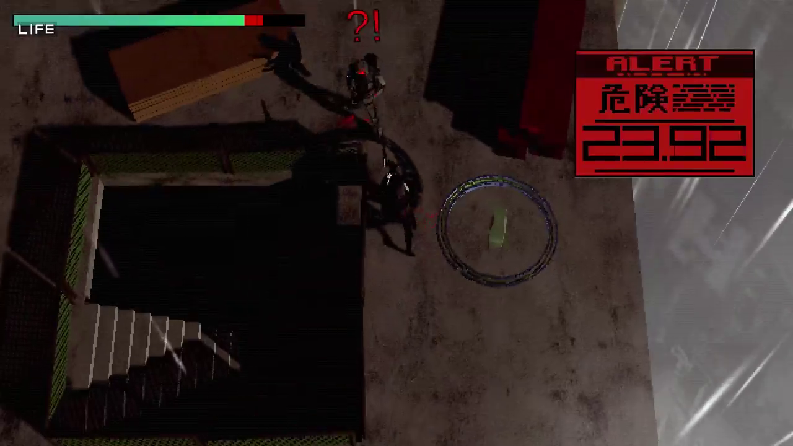</p>

## Screenshots

| | |
|:---:|:---:|
| 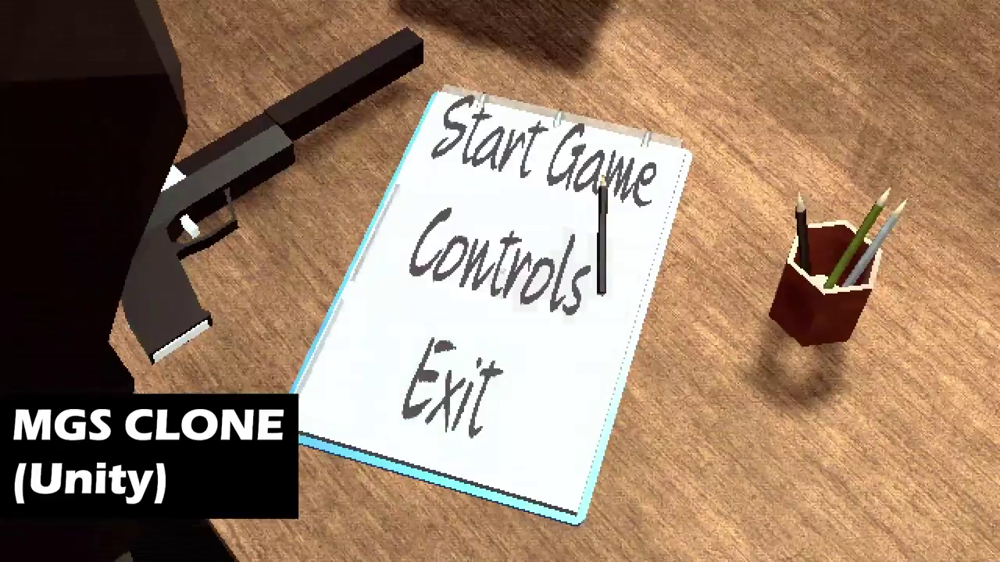 | 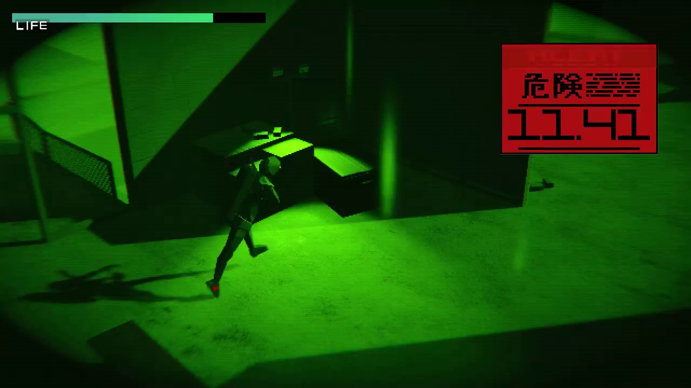 |
| 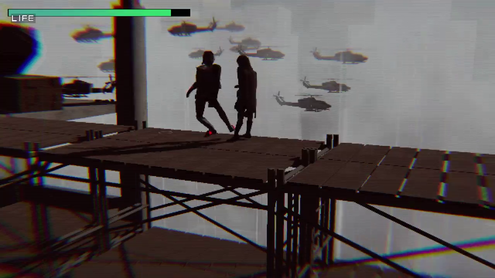 | 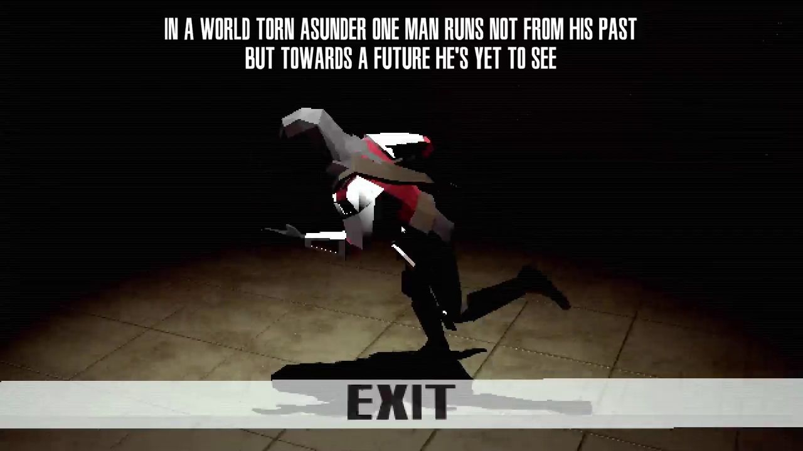 |

## Controls

| Action | Input |
|--------|-------|
| Move | WASD |
| Aim | Right mouse button |
| Shoot | Left mouse button (while aiming) |
| Grab | Hold left mouse button |
| Crouch | C |
| Free look | F |
| Switch weapon | Q |
| Inventory | Left Ctrl |
| Pause / menu | Escape |

## Tech stack

| Layer | Technology | Used for |
|-------|-----------|---------|
| Engine | Unity 2022.3 LTS | Game engine and runtime |
| Language | C# | All gameplay scripts |
| Camera | Cinemachine | Third-person, wall cover, and FPS cameras |
| AI navigation | NavMesh | Pathfinding and agent movement |
| Input | Unity Input System + legacy input | Player controls |
| UI | TextMeshPro, Unity UI | HUD, inventory, menus |
| Physics | Unity Physics | Raycasts, triggers, collisions |
| VFX | Particle System | Muzzle flash and hit effects |

## Getting started

You need Unity 2022.3 LTS (any 2022.3.x patch works).

```bash
git clone https://github.com/JakeeUp/MetalGearMechanics_Unity.git
```

1. Open the project in Unity Hub
2. Open `Assets/_MyAssets/Scenes/MainMenuScene`
3. Press Play

The repo only has my code and my own assets. The art, animation and environment packs aren't mine to redistribute, so they're left out, and the scenes will show missing models and materials until you import them yourself. The packs, by the folder name they import into:

- `Assets/`: AnimationsToon, Basic Movement Pack, Building Construction, Cyberpunk street, DreamTeamMobile, Geopipe, Imminence - Sci-fi Soldiers, Mercenary - Low Poly Assassin, Morgue Room PBR, PolyWorkshop, Rain Fx, Raptor3D, Ultra Skybox Fog, UnityTechnologies (Particle Pack), boxes_pack
- `Assets/_MyAssets/`: SciFi Warehouse Kit, plus the PSX effects, low-poly soldiers, health pickup, UI prefabs and Quikhand font in `Imports/`

The menu and level music are left out for the same reason.

## Project structure

```
Assets/_MyAssets/
├── Scripts/
│   ├── AI/                 # AIController: detection, movement, shooting
│   │   └── States/         # Patrol, Caution, Combat, Search, Grabbed
│   ├── Controller/         # Player controller, input handling
│   ├── Items/              # Weapons, pickups, cardboard box, consumables
│   ├── Managers/           # Inventory, camera, resources, game management
│   ├── SceneLoading/       # Level transitions, scene management
│   ├── UI/                 # HUD, inventory UI, countdown display
│   └── Utilities/          # Object pooling, interfaces, helpers
├── Prefabs/
├── Scenes/
├── Audio/
└── Art/
```

## License

The code is under the [MIT license](LICENSE). Third-party art, animation and audio assets keep their own licenses.
